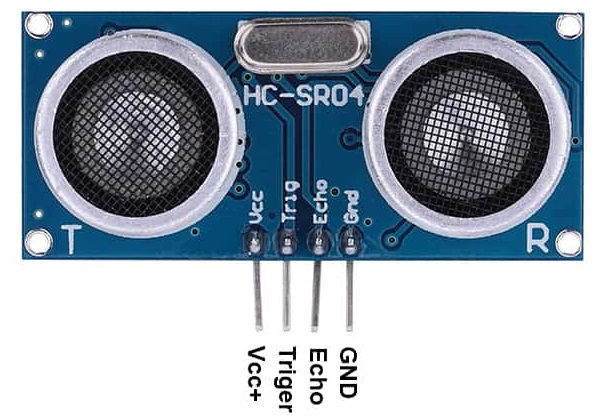
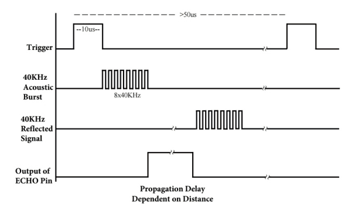

<h1><b>Projekt: Ultrazvukový měřič vzdálenosti HC-SR04</b></h1>

  

    Projekt je stanoven jako systém, který bude měřit vzdálenost od předmětů. V projektu se budou využívat dvě součástky a to je deska CoolRunner-II CPLD a ultrazvukový měřič HC-SR04. Snažíme se docílit toho, aby jsme propojili vlastnosti desky a měřiče, a výslednou vzdálenost od předmětu byla zapisována na výstup 7-segmentového displeje.
  

<h2><i>Hardware</i></h2>
  <h3>HC-SR04</h3>
    
    

      Je to součástka díky, které lze měřit vzdálenosti od předmětů. Rozsah vzdálenosti, které je tento model schopen měřit je 2 cm až 450 cm. Má vysokou přesnost měření +- 3mm. Jak lze poznat z obrázku, součástka má 4 piny (Vcc, Triger, Echo, GND). To budou naše signály, které budeme využívat, především Triger a Echo. Součástka má napájecí napětí 5V DC.
    

    <h4>Komunikace</h4>
      
      

        Komunikace měřiče s deskou probíhá pomocí dvou signálů (Trig a Echo). Na začátku se aktivuje signál "TRIG" na měřiči vzdálenosti, a to na dobu minimálně 10 μs. Po této aktivaci vyšle modul ultrazvukový signál a čeká na jeho odražení od překážky a zpětné zachycení měřičem. Mezi tím se aktivuje signál "ECHO", jehož délka je pak úměrná vzdálenosti překážky. Signál "ECHO" se deaktivuje po zachycení odraženého signálu měřičem vzdálenosti. Velikost času kdy Echo je aktivní je naše hodnota pro výpočet vzdálenosti.
      

    <h4>Naměřená veličina</h4>
      

        Jak už bylo řečeno je potřeba vzdálenost vypočítat. Hodnotu vzdálenosti získáme pomocí signálu Echo. My budeme počítat s tím, že vyslání a odraz signálu bude probíhat za těchto podmínek (Teplota: 20 °C a Rychlost vzduchu: 343 m/s). Pokud nastanou jiné podmínky musíme konstantu s číslem 58,31 přepočítat. Z toho plyne, že vzoreček bude vypadat následovně. 
      

      

        vzdálenost[cm] = doba_Echo[us] / 58,31
      

  <h3>CoolRunner-II CPLD</h3>
    

<h2><i>Code</i></h2>
  

  <h3>Zdroje</h3>
<ul>
  <li>https://navody.arduino-shop.cz/navody-k-produktum/meric-vzdalenosti-ultrazvukovy.html</li>
  <li>https://www.hwkitchen.cz/ultrazvukovy-meric-vzdalenosti-hc-sr04/</li>
  <li>https://www.santy.cz/moduly-c22/arduino-hc-sr04-modul-shield-mega-nano-vzdalenost-mereni-i23/</li>
</ul>
